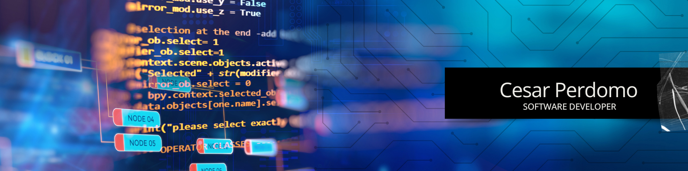

## 👋 Hello Everyone, I'm Cesar Perdomo

🚀 I am a passionate software developer focused on building modern and scalable web applications using a variety of programming languages and cloud technologies.

My current goals include:
- 🧩 Designing and consuming secure RESTful APIs  
- 💡 Creating clean, maintainable frontend architectures with React  
- 🛠️ Integrating relational databases like MySQL with dynamic applications  
- 🔐 Implementing authentication flows using JWT and token-based systems  
- ☁️ Exploring the power of Cloud computing for application deployment  

---

### 📫 Connect with me

  
  
  
<!-- Replace this URL once your portfolio is deployed -->

---

### 🎥 Featured Projects (Coming Soon)

[-FF0000?style=for-the-badge&logo=youtube&logoColor=white)](https://your-youtube-video-url-1-here)  
  
<!-- Replace each link when your videos are published -->

---

### 💻 Tech Stack & Tools

  
  
  
  
  
  
  
  

---

🧠 *“Discipline, innovation, and purpose drive everything I build.”*
